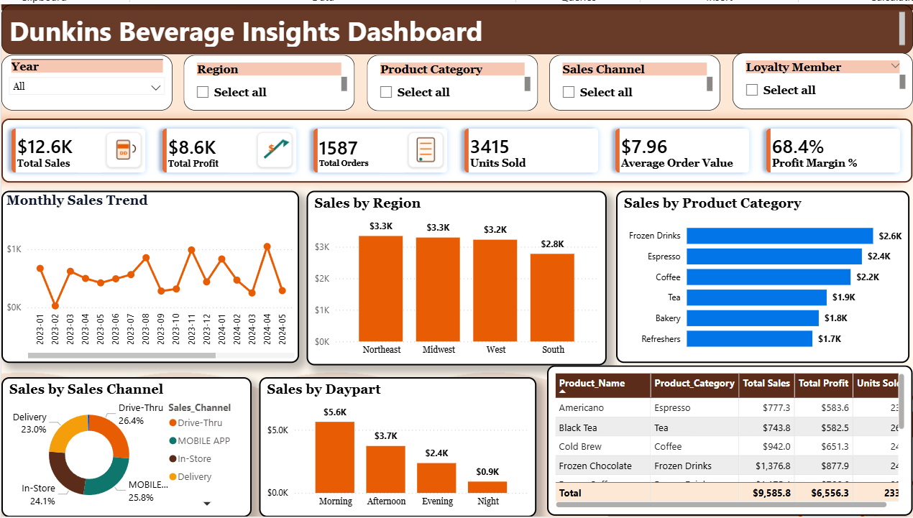
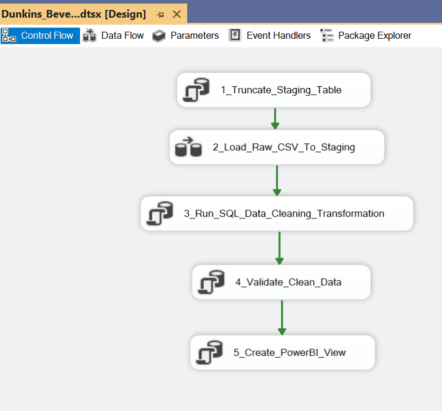

# Dunkins Beverage Insights Dashboard

This is an end-to-end beverage sales analytics portfolio project built using **Excel, SQL Server, SSIS, Power BI, and DAX**.

> Note: This project uses synthetic sample data for learning and portfolio purposes. It is not official Dunkin' data and is not affiliated with Dunkin'.

## Project Objective

The goal of this project is to analyze beverage sales performance and identify key insights related to sales, profit, orders, product categories, regions, sales channels, daypart trends, loyalty members, and refund/cancellation patterns.

## Tools Used

* Microsoft Excel
* SQL Server
* SSIS
* Power BI
* DAX
* GitHub

## Business Questions

1. What are the total sales, total profit, total orders, and profit margin?
2. Which beverage categories generate the highest sales?
3. Which products are the top performers?
4. Which regions generate the highest sales?
5. Which sales channels perform best?
6. How do sales vary by daypart?
7. What is the refund and cancellation pattern?
8. How do loyalty members contribute to sales?

## Dashboard Preview

## Project Workflow

Excel Raw Data → SSIS ETL → SQL Server Staging Table → SQL Data Cleaning → SQL Reporting View → Power BI Dashboard → GitHub Portfolio

## Key KPIs

* Total Sales
* Total Profit
* Total Orders
* Units Sold
* Average Order Value
* Profit Margin %

## Dashboard Insights

* Frozen Drinks, Espresso, and Coffee are among the strongest-performing categories.
* Morning sales generate the highest revenue compared to other dayparts.
* Regional sales are strongest in the Northeast, Midwest, and West.
* Drive-Thru, Mobile App, In-Store, and Delivery channels all contribute significantly to total sales.
* The dashboard helps compare product category performance, regional trends, sales channels, and top products.

## SQL Server Process

The raw beverage sales data was loaded into SQL Server using a staging table. SQL scripts were used to clean and transform the data by removing duplicates, trimming spaces, standardizing text values, converting data types, and validating important fields such as sales, profit, quantity, and order date.

## SSIS ETL Workflow

The SSIS package loads raw beverage sales data from CSV into the SQL Server staging table, runs SQL cleaning transformations, validates the cleaned data, and creates the Power BI reporting view.

## Power BI Dashboard

The Power BI dashboard connects to the cleaned SQL Server reporting view and uses DAX measures to calculate KPIs such as total sales, total profit, total orders, units sold, average order value, and profit margin percentage.

## Repository Files

* `data/` - Raw and cleaned datasets
* `sql/` - SQL Server scripts for database creation, data loading, cleaning, analysis, and Power BI views
* `SSIS/` - SSIS ETL guide and package screenshot
* `DB_Dashboard.png` - Final dashboard screenshot
* `Power BI_dunkins_beverage_PROJECT.pbix` - Power BI dashboard file
* `README.md` - Project documentation

## Resume Summary

Built an end-to-end beverage sales analytics project using Excel, SQL Server, SSIS, Power BI, and DAX. Developed an ETL workflow, cleaned and transformed raw data in SQL Server, created KPI measures, and designed an interactive Power BI dashboard to analyze sales, profit, product categories, regions, sales channels, daypart trends, and refund patterns.
